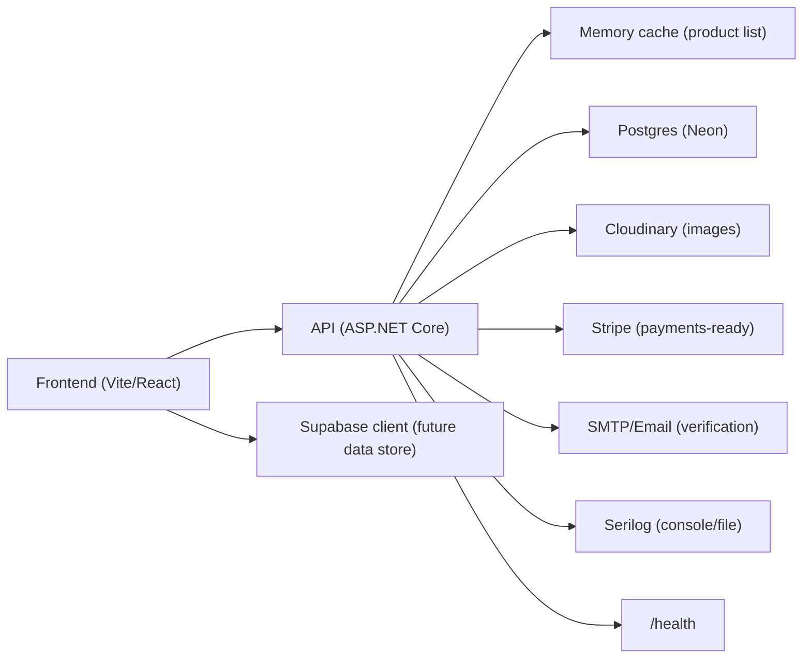

# LuxeStore System Design (High Level)

## Data Flow
- **Public catalog**: Frontend fetches products from API; API caches list responses briefly and reads from Postgres.
- **Auth**: Identity + JWT; email confirmation required. Admin endpoints gated by role (to be enforced).
- **Uploads**: Admin posts multipart to `/api/admin/products`; API uploads to Cloudinary and stores the secure URL.
- **Payments (future)**: Stripe keys configured; checkout can post to server-side Stripe integration.
- **Analytics**: `/api/analytics/track` collects user interactions; `/export` provides recent events for analysis.

## Scale & Reliability
- **Caching**: In-memory cache for product lists (with invalidation on changes in future). Add Redis when multi-instance.
- **Pagination**: Page size capped; sorting via query params.
- **Health**: `/health` endpoint for readiness checks.
- **Logging**: Serilog structured logs; add sinks (Seq/ELK) for prod.
- **Secrets**: Use environment variables (see appsettings.example.json, frontend .env.example).
- **CI/CD**: GitHub Actions to build/test API and frontend.

## Security
- Email verification enforced on login.
- JWT auth for protected routes; plan role-based `[Authorize(Roles="Admin")]` for admin endpoints.
- CORS restricted to known origins (configure per environment).
- Avoid storing secrets in git; rotate keys when exposed.

## Open Next Steps
- Add Redis-backed cache and cache invalidation on writes.
- Add rate limiting (auth endpoints, uploads).
- Add SLOs/alerts and APM tracing for critical flows.
- Move Supabase integration from mock data to live product/catalog content if desired.
